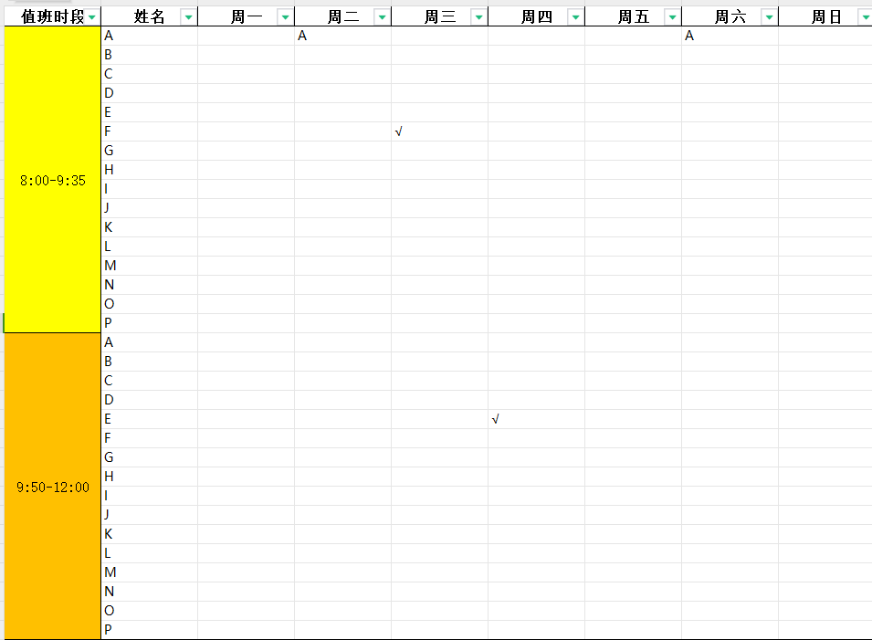

# Tools
### Schedule

这是一个自动生成排班表的脚本~

#### 使用说明

> 读取的excel文件文件名必须是sche.xlsx ！！！

```shell
pip install requirements.txt
python schedule.txt
```

根据提示选择目录后等待即可。

输入文件格式应当如下：

工作表数量应当有两张，格式相同。

#### 输出说明

由于整个软件运行时间较长，因此每一分钟会输出一个中间文件，用户可以选择仅使用中间文件。

每隔五分钟用户可选择是否中断当前进程，直接进入下一进程。

#### 打包说明

```shell
pip install pyinstaller
pyinstaller -F --onefile --name=sche schedule.py --hidden-import=openpyxl.cell._writer
```

`exe` 文件将生成在 `dist` 文件夹下 
